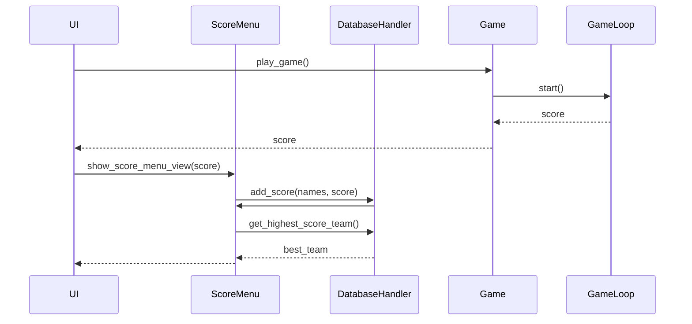

```mermaid
sequenceDiagram
  participant UI
  participant ScoreMenu
  participant DatabaseHandler
  participant Game
  participant GameLoop
  UI->>Game: play_game()
  Game->>GameLoop: start()
  GameLoop-->>Game: score
  Game-->>UI: score
  UI->>ScoreMenu: show_score_menu_view(score)
  ScoreMenu->>DatabaseHandler: add_score(names, score)
  DatabaseHandler->>ScoreMenu: 
  ScoreMenu->>DatabaseHandler: get_highest_score_team()
  DatabaseHandler-->>ScoreMenu: best_team
  ScoreMenu-->>UI: 
```
